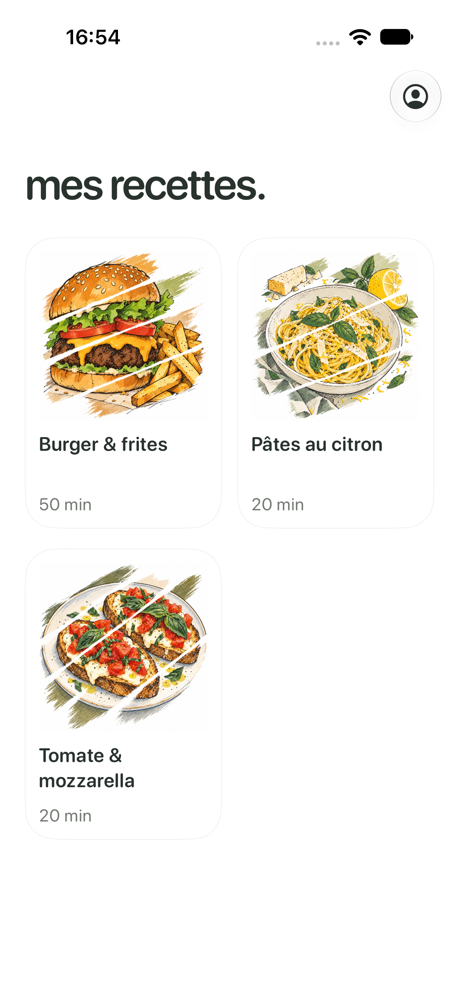

# Petit Chef

Application iOS de cuisine guidée, en SwiftUI, pour Xcode 27 / iOS 27.

[](https://github.com/RaShoto7/petit-chef/actions/workflows/ios.yml)

## Récupérer le projet

```sh
git clone https://github.com/RaShoto7/petit-chef.git
cd petit-chef
./scripts/simulator.sh run
```

Prérequis : **Xcode 27**, **iOS 27 Simulator** et **Metal Toolchain**. Le script choisit un iPhone disponible et ne nécessite aucun compte Apple pour le simulateur. [Installation et travail à plusieurs](CONTRIBUTING.md).



## Direction visuelle : tartines

Accueil en Fraunces Italic embarquée, titres de recette en serif, cartes Liquid Glass transparentes aux contours fermés, minuteur ancré en bas et sections au dépliage stable. Les préparations des tartines utilisent des croquis vectoriels animés ; le dressage teste une nouvelle scène réalisée en 3D dans Blender et lue en vidéo transparente. [Pilote et recherche de frameworks](docs/design/animation-pilot/README.md). Chaque transition sépare le départ, une courte respiration et l’arrivée ; le geste commence ensuite. Les commandes inutiles disparaissent au début et à la fin ; **Terminer** revient directement à l’accueil. [Choix de rendu et limites](docs/design/tartines-premium.md).

## Version 0.4

- **mes recettes.** : grille de deux cartes par ligne, fond blanc, illustrations originales en croquis et touches de pinceau diagonales. Le profil est le seul accès aux réglages ; aucune barre d’onglets.
- **Fiche** : bouton compact « C’est parti », quantités pour 1 à 12 personnes, ingrédients modifiables un par un (nom, quantité, unité, ajout, suppression), annuler/rétablir, matériel et allergènes avec pictogrammes dessinés. Les références restent dans la documentation.
- **Étapes** : texte neutre, gestes animés correspondant à l’action, navigation précédente/suivante et sommaire. Consulter une étape n’effectue aucune action et ne relance aucun minuteur.
- **Liberté de préparation** : une étape peut être effectuée en avance après confirmation de ses prérequis manquants. Le moteur mémorise cette décision. Une cuisson peut être raccourcie, prolongée, réglée directement en heures/minutes/secondes en touchant le chrono, ou arrêtée en un tap sur la croix, sans confirmation supplémentaire.
- **Minuteurs système** : AlarmKit, extension WidgetKit de compte à rebours pour la Dynamic Island et l’écran verrouillé. Une seule source de vérité pour les échéances ; pas de compteur décrémenté en mémoire.
- **Compte** : Sign in with Apple facultatif, identité locale dans le trousseau ; réglages °C/°F et retours tactiles.

## Lancer

Installer si nécessaire le composant Metal Toolchain depuis Xcode > Settings > Components (ou `xcodebuild -downloadComponent MetalToolchain`).

Ouvrir `Petit Chef.xcodeproj`, scheme **Petit Chef**, puis **⌘R** sur un iPhone Simulator ou un iPhone signé.

```sh
xcodebuild -project 'Petit Chef.xcodeproj' -scheme 'Petit Chef' \
  -destination 'platform=iOS Simulator,name=iPhone 18 Pro' \
  -derivedDataPath /tmp/PetitChefDerivedData CODE_SIGN_IDENTITY=- build
```

Sur appareil, choisir une équipe Apple Developer et un profil autorisant Sign in with Apple. L’extension `CookingWidgets` doit être signée par la même équipe. L’autorisation AlarmKit est demandée au premier minuteur ou dans les réglages. L’app ne peut pas créer une entrée dans l’application Horloge : elle utilise l’API système officielle destinée aux minuteurs tiers.

Si la signature signale « resource fork / Finder information », placer DerivedData hors du dossier Documents synchronisé, comme dans la commande ci-dessus. Le dossier de compilation par défaut de Xcode convient également.

## Architecture

- `Domain/Recipe.swift` : recettes et étapes `Codable` ; `RecipeLibrary.swift` : personnalisations persistées et mise à l’échelle numérique.
- `Data/` : trois recettes adaptées et documentées, sans scraping automatique ni reproduction des photos ou textes sources.
- `Cooking/CookingEngine.swift` : transitions déterministes, dépendances et choix explicites d’ordre. Aucune décision de planning confiée à une IA.
- `Cooking/CookingStore.swift` : session et copie des ingrédients choisis au démarrage, persistance et synchronisation sérialisée des rappels.
- `Cooking/CookingAlarms.swift` : autorisation et programmation AlarmKit, inventaire local des alarmes appartenant aux sessions de l’app. Une alarme arrêtée dans l’interface système n’est pas recréée sans modification explicite de sa durée et ne marque pas automatiquement un aliment comme cuit.
- `Shared/` : métadonnées AlarmKit et App Intent communs à l’app et à l’extension.
- `CookingWidgets/` : présentation du compte à rebours en activité en direct, Dynamic Island compacte, étendue et minimale.
- `Illustrations/` : illustrations du catalogue, gestes dessinés en Canvas, dont six scènes détaillées pour les tartines (60 images/s demandées, 30 en économie d’énergie pour Canvas). Réduire les animations affiche une pose fixe. `Shaders/` : révélation au pinceau, grain fixe et chaleur en Metal.
- `Features/` : accueil, fiche, éditeur d’ingrédients, cuisine et paramètres.

Les préférences d’ingrédients ne modifient pas une session déjà commencée. Elles ne réécrivent pas non plus les instructions culinaires. Les durées et températures ne sont pas multipliées avec les portions. Les allergènes restent une information de référence à vérifier après toute substitution.

## Vérification

La suite comprend 23 tests unitaires et 4 parcours UI (personnalisation/navigation/reprise, ajout/suppression, illustrations et tartines). Pour le pilote Blender et Fraunces, les 23 tests unitaires et le parcours UI tartines ont été vérifiés sur iPhone 18 Pro Simulator, iOS 27. Le parcours burger a été vérifié lors de l’itération précédente. Les tests UI ordinaires utilisent un stockage séparé et des notifications locales désactivées. Le test `testSystemTimerAuthorizationAndBackground` exerce séparément AlarmKit réel, avec son autorisation système, puis annule le minuteur. Ce contrôle a été ignoré explicitement sur ce simulateur : AlarmKit refuse l’autorisation, y compris après compilation signée localement. L’affichage réel de la Dynamic Island n’est donc pas encore validé.

```sh
xcodebuild -project 'Petit Chef.xcodeproj' -scheme 'Petit Chef' \
  -destination 'platform=iOS Simulator,name=iPhone 18 Pro' \
  -derivedDataPath /tmp/PetitChefDerivedData -parallel-testing-enabled NO \
  CODE_SIGN_IDENTITY=- test
```

Captures : [accueil](docs/screenshots/v0.4/home.png), [fiche](docs/screenshots/v0.4/recipe.png), [édition](docs/screenshots/v0.4/ingredients.png), [découpe](docs/screenshots/v0.4/cutting.png), [minuteur](docs/screenshots/v0.4/timer-editor.png), [allergènes](docs/screenshots/v0.4/allergens.png).

## Références et limites

- [Choix de mouvement et rendu natif](docs/design/motion-v04.md).

- [Références culinaires et choix de durée](docs/recipe-references.md). Ces adaptations restent à tester en cuisine.
- [Illustrations générées, chemins et prompts](docs/design/illustrations-v04.md). Les images sont livrées dans le catalogue d’assets, disponibles hors ligne.
- [Apple : AlarmKit et son activité en direct](https://developer.apple.com/videos/play/wwdc2025/230/).
- [Apple : programmer une alarme](https://developer.apple.com/documentation/alarmkit/scheduling-an-alarm-with-alarmkit).
- [Apple : Liquid Glass](https://developer.apple.com/documentation/SwiftUI/Applying-Liquid-Glass-to-custom-views).

La connexion Apple et le comportement complet des alarmes sur appareil verrouillé restent à valider sur un iPhone signé. Voix et IA locale MLX ne sont pas intégrées. Les gestes restent des illustrations : ils ne remplacent pas les instructions culinaires. Le tag `v1.0` sera créé lorsque la Phase 1 sera validée ; la version actuelle reste une version de développement.
