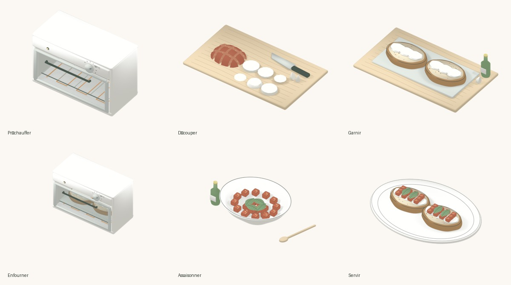

# Fraunces et scènes Blender — 1 octobre 2026

## Choix de police

**Fraunces Italic**, par Undercase Type. Elle apporte des formes plus souples et expressives que la police système, tout en restant lisible. L’app embarque une instance fixe (`wght=550`, `opsz=72`, `SOFT=45`, `WONK=1`), nommée `Fraunces Petit Chef` pour identifier cette déclinaison. Taille de base 42 points, adaptée à Dynamic Type. Le titre conserve ses minuscules et son point. `fontDesign(nil)` neutralise le dessin arrondi hérité du reste de l’écran, qui remplacerait sinon la police personnalisée.

La licence SIL OFL et son attribution sont incluses dans le bundle. Source : [site des auteurs](https://fraunces.undercase.xyz/), [distribution Google Fonts](https://github.com/google/fonts/tree/main/ofl/fraunces). Le fichier source peut être instancié avec `fontTools.varLib.instancer` ; aucun accès réseau n’est nécessaire dans l’application.

## Recherche de solutions

| Solution | Ce qu’elle apporte | Conséquence pour Petit Chef |
| --- | --- | --- |
| [Rive Apple runtime](https://github.com/rive-app/rive-ios) | Dessins vectoriels, animation interactive et machines à états, intégration SwiftUI | Bon candidat pour des gestes 2D dessinés et riggés. Il faut créer les dessins et les animations dans l’éditeur ; importer le runtime seul ne transforme pas nos scènes. |
| [Lottie iOS](https://github.com/airbnb/lottie-ios) | Lecture d’animations dessinées et exportées, moteur Core Animation | Adapté aux petites animations d’interface. Les scènes détaillées exigent toujours des assets préparés. |
| [RealityKit](https://developer.apple.com/documentation/realitykit) | Rendu et animation de modèles 3D en temps réel | Intéressant si l’utilisateur doit manipuler les objets. Modèles, textures et rendu dessiné restent à produire ; nos anciennes primitives étaient insuffisantes. |
| [Blender et Grease Pencil](https://docs.blender.org/manual/en/latest/grease_pencil/) | Modélisation, animation, contours dessinés et rendu préparé | La piste retenue pour les séquences de recette : elle permet de vérifier chaque pose et chaque contact avant livraison. |
| [AVFoundation / HEVC avec alpha](https://developer.apple.com/videos/play/wwdc2019/506/) | Lecture native d’une vidéo sur un fond transparent | Transporte le rendu Blender dans SwiftUI. Lecture locale, sans contrôles vidéo ni calcul de planning. |

La recherche de plugins Codex a renvoyé notamment Runway et Higgsfield, des services de création de médias. Aucun n’a été installé. Pour ce pilote, Blender est déjà installé et accessible directement. La recherche du catalogue n’est pas exhaustive ; un plugin de génération de vidéo ne dispense pas de vérifier la fidélité des gestes culinaires.

**Décision : Blender pour l’animation et le rendu, AVFoundation pour la lecture iOS.** Le compromis est explicite : ce sont de vrais objets 3D lors de la création, puis une séquence vidéo à caméra fixe dans l’app. On ne peut pas tourner autour du plat en touchant l’écran. La qualité dépend du travail sur les objets et les poses ; ce pilote valide le chemin technique, pas la direction artistique définitive des six scènes.

## Pilote initial : dressage des tartines

La scène `toast-pilot.blend` comprend une assiette tournée, deux pains avec croûte et mie, des tranches de mozzarella, des dés de tomate et des feuilles de basilic courbées avec nervures. Les modèles sont créés dans le script, sans téléchargement de modèles externes. Le rendu Eevee utilise des matériaux à teintes étagées et des courbes de contour et de hachure ; ce premier pilote n’utilise pas encore de traits Grease Pencil peints à la main.

Les ingrédients arrivent successivement et se posent sur leurs surfaces. Les poignées Bézier sont bornées pour éviter qu’un objet traverse le pain. La vidéo contient 144 images à 24 images/s, soit 6 secondes, avec transparence HEVC. La première version pesait environ 610 Ko. Le pilote est conservé comme source historique ; le dressage actuel a été repris dans `toast_scenes.py` pour commencer avec des tartines déjà gratinées, sans reposer le fromage.

La lecture attend la fin de l’arrivée de la carte, s’interrompt quand l’app est inactive et garde la dernière image à la fin. Réduire les animations affiche directement la pose finale. Le minuteur et le moteur de recette ne lisent jamais la position de la vidéo.

## Les six scènes actuelles

| Étape | Ressource | Durée | Geste représenté |
| --- | --- | --- | --- |
| Préchauffer le four | `toast-preheat` | 6 s | Four vide et fermé, thermostat à 180 °C, voyant et résistance de chauffe |
| Découper les ingrédients | `toast-cutting` | 8 s | Demi-tomate réellement divisée, six tranches de mozzarella et deux moitiés d’ail |
| Garnir le pain | `toast-building` | 8 s | Pain sur la plaque, face coupée de l’ail frottée, huile reliée au goulot puis mozzarella |
| Gratiner les tartines | `toast-baking` | 6 s | Porte articulée, insertion de la plaque, fermeture et chaleur |
| Assaisonner les tomates | `toast-seasoning` | 8 s | Huile, basilic, sel et poivre, mélange progressif puis cuillère reposée |
| Servir les tartines | `toast-plating` | 6 s | Tartines déjà gratinées, dépôt des tomates puis du basilic |

`toast_scenes.py` construit les objets et pose les clés de chaque geste. `toast_scene_tools.py` reprend les matériaux, les courbes de contour et les clés bornées du pilote. Les modèles restent volontairement stylisés : le geste lisible prime sur le photoréalisme. Les scènes n’utilisent pas de Grease Pencil peint à la main. Le film de gratinage illustre l’enfournement ; il ne simule pas les huit minutes de cuisson de la recette.

Les sources éditables sont dans [scenes/](scenes/). Les premiers et derniers PNG sont embarqués avec chaque vidéo : image d’attente du lecteur et pose fixe pour Réduire les animations. `AuthoredToastScene` associe les six étapes aux ressources et permet aux tests de détecter une étape oubliée.



## Reproduire

Blender 5.2 est nécessaire pour recréer les images. Xcode et Swift servent à l’encodage HEVC avec alpha.

Pour reconstruire les six scènes actuelles, leurs vidéos, leurs deux images fixes et leurs fichiers `.blend` :

```sh
./scripts/animation/render_toast_scenes.sh /tmp/PetitChef-toast-scenes
# Contrôler cinq poses par scène avant de tout rendre :
./scripts/animation/render_toast_scenes.sh /tmp/PetitChef-toast-scenes preview-only
# Rendre uniquement une scène après le contrôle des six :
./scripts/animation/render_toast_scenes.sh /tmp/PetitChef-toast-scenes render toast-cutting
# Réencoder des images déjà rendues :
./scripts/animation/render_toast_scenes.sh /tmp/PetitChef-toast-scenes encode-only
# Examiner les moments de contact, de versement et d’insertion :
/Applications/Blender.app/Contents/MacOS/Blender -b --python-exit-code 1 \
  --python scripts/animation/validate_toast_scenes.py -- \
  /tmp/PetitChef-toast-scenes --render-inspection
```

Le script utilise Blender installé dans `/Applications/Blender.app` ; `BLENDER_BIN` permet de changer son emplacement. Pour travailler sur une seule scène, ajouter `--scene toast-cutting` à la commande Blender de `toast_scenes.py`.

Le rendu se fait scène par scène. Après encodage, les PNG intermédiaires sont supprimés ; `PETITCHEF_KEEP_FRAMES=1` permet de les conserver hors du dépôt pour examiner une séquence. Les poses de contrôle et les fichiers `.blend` restent disponibles dans le dossier de sortie. L’app embarque la vidéo, une image initiale et une pose finale ; aucun Blender ni service distant n’est requis sur le Mac du collaborateur pour compiler ou tester.

## Vérification

`validate_toast_scenes.py` relit les scènes enregistrées et contrôle les volumes avant/après coupe, le couteau et les aliments au-dessus de la planche, les tomates à l’intérieur du bol, le départ de l’huile au goulot à chaque image, le four vide et entièrement cadré lors du préchauffage et l’état déjà gratiné du dressage. Les 448 316 contrôles de géométrie et de mouvement passent sur les scènes finales. Cette vérification précède le rendu complet dans le script. La vitre utilise un mélange transparent sans tramage temporel. Six tranches de mozzarella à la découpe deviennent trois tranches sur chacune des deux tartines illustrées.

Les tests des ressources vérifient que la police se charge, que chaque étape possède sa scène, que les six films sont lisibles et contiennent un canal alpha, que leurs durées sont correctes et que leurs premières et dernières images se décodent à 840 × 640. Le parcours UI des tartines vérifie la navigation complète, le retour arrière, l’arrêt du minuteur et la fin de recette ; il capture les six animations intégrées. La fluidité, le décodage et la consommation sur iPhone physique restent à mesurer. Les poses culinaires restent des illustrations à confronter aux gestes réels.

Vérification locale du 1 octobre 2026, après la reprise des gestes et du cadrage : compilation, 24 tests unitaires (dont six variantes de contrôle des vidéos) et quatre parcours UI réussis sur **Petit Chef Croquis**, iPhone 18 Pro / iOS 27. Le résultat compte 28 cas et 33 exécutions, sans échec. Rapport local : `/tmp/PetitChef-toast-precision.xcresult`. [Captures intégrées dans l’app](../../screenshots/tartines-blender/overview.jpg). Le test AlarmKit système reste exclu par le script de vérification ; cette itération ne modifie pas les alarmes.

La préparation du pain est désormais regroupée avec la garniture. La première instruction ne demande que le préchauffage ; durées, portions, dépendances et minuteurs restent identiques.
