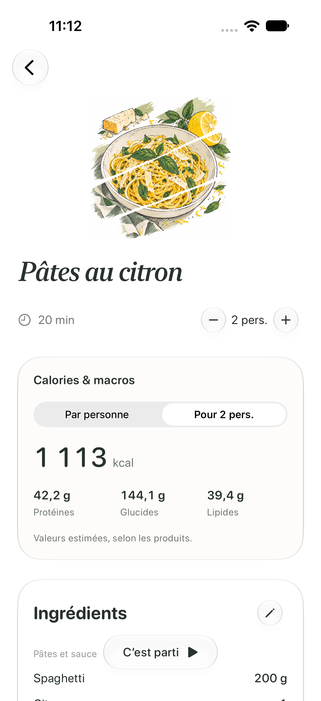
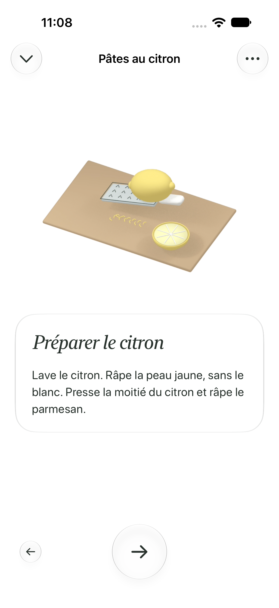
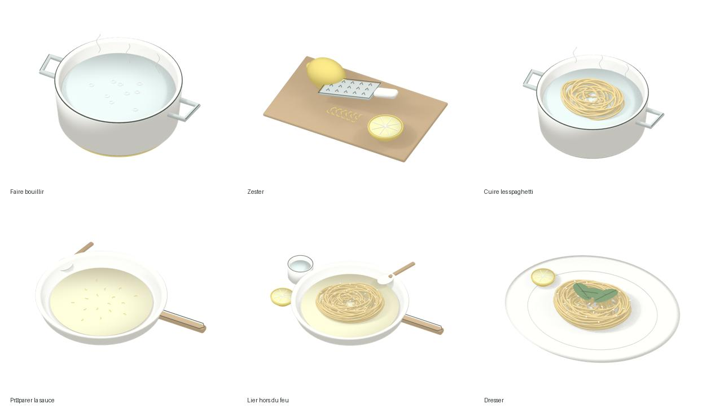

# Pâtes au citron

Cette présentation concerne uniquement `lemon-pasta`. Six étapes, mêmes dépendances, même cuisson de huit minutes ajustable au paquet. Les indications emploient des phrases courtes : peau jaune sans le blanc, beurre à feu doux, parmesan hors du feu, eau de cuisson ajoutée progressivement.

## Calories et macros

La carte de recette montre par défaut le total pour le nombre de personnes choisi. Le sélecteur « Par personne » divise les quatre valeurs par le nombre de parts. Les calculs utilisent les quantités numériques actuelles, avant arrondi : passer de deux à quatre personnes double le total et conserve la même part individuelle. Modifier une quantité ou supprimer un ingrédient recalcule le total. Remplacer un nom ou une unité, ou ajouter un ingrédient inconnu, rend l’estimation indisponible plutôt que d’afficher un total incomplet.

Références pour 100 g, consultées le 2 octobre 2026 :

| Aliment | kcal | Protéines (g) | Glucides (g) | Lipides (g) |
| --- | ---: | ---: | ---: | ---: |
| Spaghetti secs | 359 | 12,8 | 70,9 | 2 |
| Parmesan | 402 | 32,4 | 0 | 29,7 |
| Beurre doux | 744 | 0,8 | 0,6 | 82 |
| Jus de citron | 22 | 0,35 | 6,6 | 0,24 |
| Zeste | 47 | 1,5 | 5,4 | 0,3 |
| Basilic frais | 23 | 3,15 | 1,05 | 0,64 |

Sources primaires : [Barilla, spaghetti n° 5](https://www.barilla.com/fr-ch/produits/pates/classique/spaghetti-no-5), [Consortium du Parmigiano Reggiano](https://www.parmigianoreggiano.com/fr/le-fromage-decouvrir-nutrition-et-sante), [Paysan Breton, beurre doux](https://www.paysanbreton.com/nos-produits/nos-beurres/le-beurre-doux-moule), USDA SR28 [fruits et jus](https://www.ars.usda.gov/ARSUserFiles/80400535/Data/SR/SR28/reports/sr28fg09.pdf) (NDB 09152 et 09156), [herbes](https://www.ars.usda.gov/ARSUserFiles/80400535/Data/SR/SR28/reports/sr28fg02.pdf) (NDB 02044). Pour les trois références USDA, les fibres sont soustraites des glucides totaux pour suivre la convention des étiquettes européennes.

Hypothèses culinaires : les 200 g de pâtes sont pesés secs ; un citron correspond à 30 g de jus utilisé (la moitié du fruit pressé) et 2 g de zeste ; une feuille de basilic pèse environ 0,5 g. Sel et poivre ne contribuent pas significativement aux quatre valeurs affichées. La taille des fruits et les produits changent les résultats : l’interface indique « Valeurs estimées, selon les produits ». L’énergie provient des données sources, pas d’une reconstruction arrondie à partir des macros.

La recette de base pour deux personnes représente environ **1 113 kcal, 42,2 g de protéines, 144,1 g de glucides et 39,4 g de lipides**, soit **557 kcal par personne**. Les références ci-dessus sont des hypothèses de composition et ne prescrivent aucune marque.

## Animations

Six scènes préparées avec Blender, dans la palette ivoire, citron et graphite des tartines : eau à ébullition, passage du citron sur la râpe, spaghetti plongés dans l’eau, beurre fondu avec les zestes et l’eau de cuisson, liaison hors du feu, dressage au basilic. Caméra fixe, gestes espacés, mouvements bornés, surfaces simples et contours fins. Les spaghetti sont des brins courbes individuels ; le jus et l’eau partent des ustensiles. Chaque vidéo dure six ou huit secondes à 24 images/s et garde sa pose finale.

Le lecteur natif existant se suspend pendant l’arrivée de la carte et quand l’application devient inactive. Revenir à une étape recommence sa scène. Réduire les animations affiche la pose finale. Les vidéos transparentes sont locales : aucun calcul 3D ni accès réseau sur l’iPhone. Leurs durées illustrent les gestes et ne modifient jamais le minuteur de cuisson.

Reproduction :

```sh
./scripts/animation/render_lemon_pasta_scenes.sh /tmp/PetitChef-lemon-scenes preview-only
./scripts/animation/render_lemon_pasta_scenes.sh /tmp/PetitChef-lemon-scenes
# Réencoder des images déjà rendues :
./scripts/animation/render_lemon_pasta_scenes.sh /tmp/PetitChef-lemon-scenes encode-only
```

Sources : `scripts/animation/lemon_pasta_scenes.py`, outils de matériaux existants des tartines, scènes éditables dans `lemon-pasta/scenes/`. Les PNG de travail restent dans le dossier temporaire de sortie ; seules les vidéos, poses initiales/finales et sources éditables sont livrées.

## Vérification

Tests du calcul pour une à douze personnes, des quantités personnalisées restaurées, suppressions et ingrédients inconnus. Contrôle des six vidéos : lecture, transparence, durée, images initiales/finales et poses de Réduire les animations. Parcours UI ciblé : total et part individuelle, portions, six étapes, retour arrière et arrêt du minuteur avant de finir. La fluidité et la consommation sur l’iPhone physique restent à valider.

Vérification locale du 2 octobre 2026 : compilation réussie, 30 tests unitaires et deux parcours UI réussis sur iPhone 18 Pro / iOS 27. Les deux rapports comptent 32 cas, sans échec : `/tmp/PetitChef-lemon-checks.xcresult` et `/tmp/PetitChef-lemon-layout.xcresult`. Le second parcours vérifie que les trois macros sont lisibles sans défiler et au-dessus du bouton de démarrage.

 


