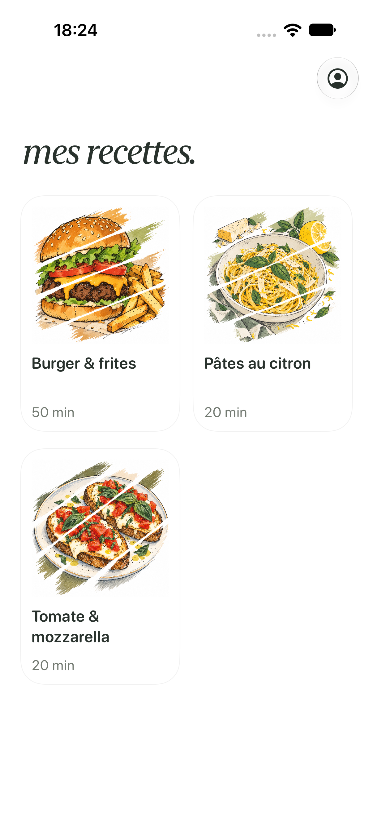
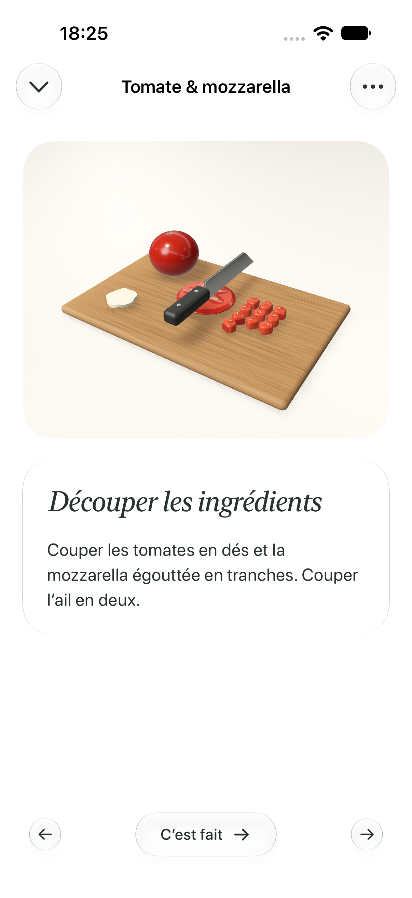

# Tartines : direction visuelle et mouvement

Les tartines servent de recette pilote. Les illustrations dessinées du catalogue restent en place. Les titres utilisent la serif italique du système ; le corps et les commandes gardent leur police lisible. Les cartes d’ingrédients, de matériel et d’instructions utilisent le matériau natif Liquid Glass `clear`, avec un fond opaque quand Réduire la transparence est activé.

Les sections Étapes et Matériel conservent leur contenu et leur surface pendant le dépliage. L’animation change leur hauteur visible et leur opacité. Le geste de pression n’anime pas une seconde fois toute la surface. Le titre d’étape arrive du bas et sort vers le haut ; le défilement ne lance plus une deuxième animation concurrente. La navigation arrière inverse le sens et les pressions sont bloquées pendant la transition.

## Rendu des gestes

`ToastPreparationView` conserve une seule vue RealityKit pendant le parcours. Le mode non-AR ne demande aucun accès à la caméra. Six scènes locales couvrent le four, la découpe, la garniture, la cuisson, le mélange et le dressage.

Les objets utilisent des maillages procéduraux et des matériaux physiques : métal du couteau et du four, céramique, bois, croûte, mie, tomates et basilic. Les textures de pain et leurs normales sont produites une fois à partir d’une graine fixe. Les changements d’étape font évoluer le cadrage et croisent les scènes. Les animations visuelles ne déclenchent jamais une cuisson, une validation ni un minuteur.

RealityKit est retenu pour les caméras, maillages, lumières, ombres et matériaux ; SwiftUI anime l’interface. Les shaders Metal existants restent utilisés par les illustrations des autres recettes. Écrire un moteur 3D complet en Metal ne résoudrait pas à lui seul la qualité des modèles.

- [Apple : matières et éclairages réalistes dans RealityKit](https://developer.apple.com/documentation/realitykit/applying-realistic-material-and-lighting-effects-to-entities)
- [Apple : PhysicallyBasedMaterial](https://developer.apple.com/documentation/realitykit/physicallybasedmaterial)
- [Apple : Liquid Glass dans les vues personnalisées](https://developer.apple.com/documentation/swiftui/applying-liquid-glass-to-custom-views)

## Vérification et limites

Le test UI des tartines ouvre et ferme chaque section trois fois, parcourt les six étapes, revient en arrière, termine explicitement le minuteur, contrôle les commandes absentes et vérifie que Terminer ramène à la grille. Des captures du simulateur permettent de contrôler les scènes et la typographie. Les tests existants couvrent toujours les ingrédients personnalisés, les quantités, la navigation et la reprise des minuteurs.

Réduire les animations utilise une pose fixe et supprime les déplacements SwiftUI. Les mises à jour de mouvement sont suspendues lorsque l’app est inactive ; la souscription RealityKit est annulée à la destruction de la vue. Le rendu reste une 3D illustrative, pas de la photogrammétrie. L’évaluation thermique, énergétique et de fluidité sur un iPhone physique reste à faire ; les résultats simulateur ne la remplacent pas.

## Captures du simulateur

  

Validation locale : Xcode 27.0, iPhone 18 Pro iOS 27 ; 21 tests unitaires et 4 parcours UI réussis. Le test d’autorisation réelle AlarmKit est exclu, comme dans la commande habituelle du projet.
