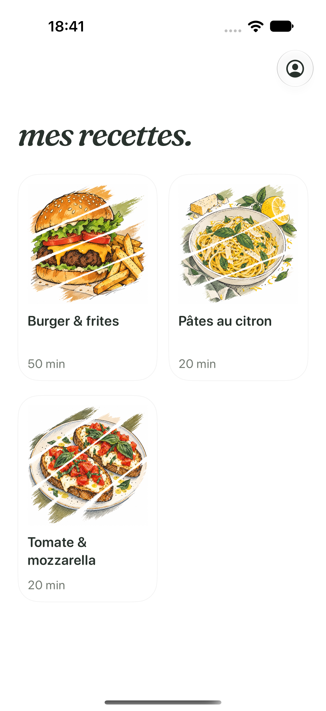
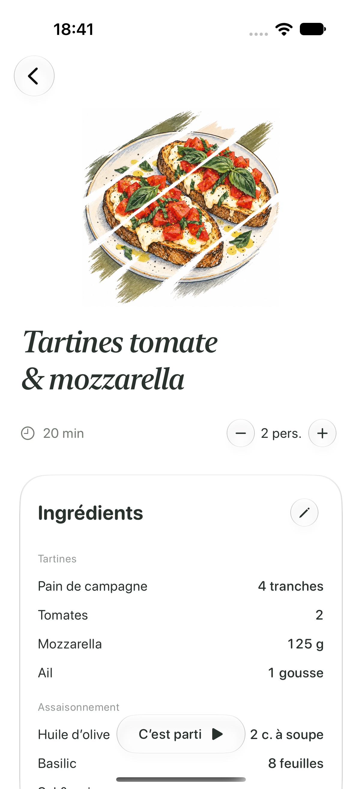
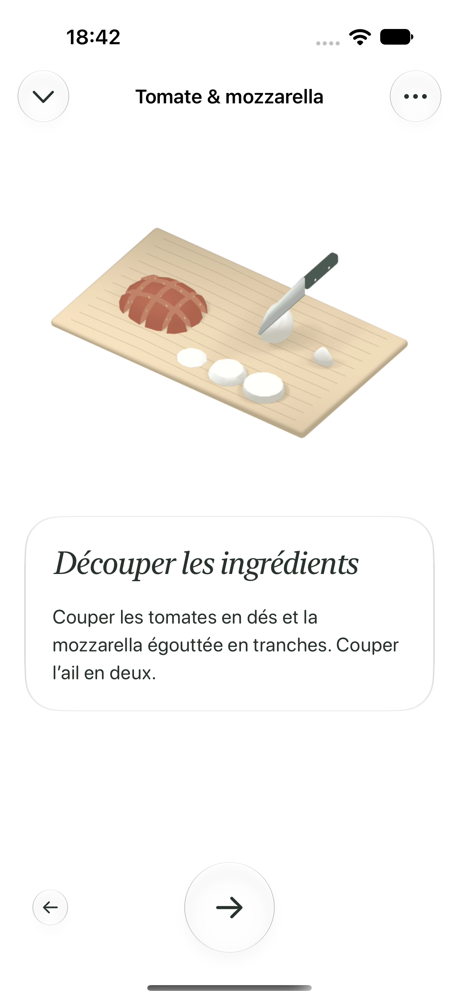

# Tartines : direction visuelle et mouvement

Les tartines servent de recette pilote. Le titre « mes recettes. » utilise Fraunces Italic, embarquée sous licence SIL OFL, avec des formes arrondies et un espacement resserré. Les titres de recette et d’étape conservent leur serif italique. Les cartes d’ingrédients, de matériel et d’instructions utilisent Liquid Glass `clear`, avec un fond opaque quand Réduire la transparence est activé. Un contour continu de 0,75 point complète les reflets du verre : la bulle reste fermée sur un fond blanc.

Les sections Étapes et Matériel conservent leur contenu et leur surface pendant le dépliage. L’animation change leur hauteur visible et leur opacité, sans une seconde animation de pression sur toute la surface.

## Navigation

La grande flèche centrale valide et avance. La flèche précédente reste à gauche et disparaît à la première étape. Un appui prolongé sur la flèche centrale permet de consulter la suite sans valider ; le sommaire reste accessible par le menu supérieur.

Une transition prend environ 1,15 seconde : départ vers le haut (0,42 s), changement du contenu invisible et respiration (0,08 s), arrivée depuis le bas (0,65 s). La navigation arrière inverse le déplacement. Les boutons sont bloqués jusqu’à la fin réelle de l’animation, et le dessin commence après l’arrivée. Le défilement ne lance aucune animation concurrente.

L’entrée en cuisine utilise la transition native `crossFade` d’iOS 27, suivie d’une arrivée verticale de la première carte.

Le minuteur reste ancré en bas, au-dessus de la navigation, dans une carte Liquid Glass transparente avec des chiffres de 27 points. La croix du minuteur l’arrête immédiatement. Toucher le chrono permet toujours de régler sa durée. Le bouton final **Terminer**, agrandi et sans icône, revient à la grille ; les commandes de navigation disparaissent à la fin.

## Scènes animées

Les six étapes utilisent désormais `AuthoredCookingAnimation`, avec des objets créés et animés dans Blender. Les vidéos locales en HEVC avec alpha conservent le fond transparent et le rendu dessiné du dressage : teintes étagées, contours, alvéoles de mie et nervures du basilic. La caméra orthographique reste fixe et les scènes sources `.blend` sont conservées pour retoucher les poses.

Préchauffage : four vide et fermé, rotation du thermostat vers la graduation 180 °C, allumage du voyant et de la résistance. Découpe : le couteau touche la planche avant la séparation des dés, puis tranche la mozzarella et sépare l’ail. Garniture : pain sur la même plaque qu’à l’enfournement, frottement de la face coupée de l’ail, filet d’huile relié au goulot et pose du fromage. Gratinage : ouverture de la porte sur sa charnière, insertion de la plaque et fermeture. Assaisonnement : huile, basilic, sel et poivre puis mélange progressif ; la cuillère revient sur le plan de travail. Le dressage commence avec le pain et le fromage déjà gratinés, puis ajoute uniquement les tomates et le basilic.

Les séquences durent 6 ou 8 secondes à 24 images/s, puis gardent leur pose finale. Elles illustrent les gestes sans accélérer ni déclencher les vrais minuteurs. La lecture commence après l’arrivée de la carte, se suspend pendant les transitions et quand l’app est inactive. Revenir à une étape recrée sa scène depuis le début. Réduire les animations affiche une image finale fixe ; les déplacements de l’interface sont également supprimés.

Le moteur de cuisson, les durées et les ingrédients restent indépendants des scènes. Aucun modèle ni asset distant n’est chargé par l’app. La fluidité, la consommation et la chauffe sur iPhone physique restent à mesurer.

## Vérification

Les six étapes utilisent des scènes préparées en 3D dans Blender, puis lues localement en vidéo transparente. [Recherche, compromis et sources](animation-pilot/README.md). Le choix conserve la direction dessinée demandée et le contrôle des contours. Sources Apple consultées : [Canvas](https://developer.apple.com/documentation/swiftui/canvas), [Liquid Glass](https://developer.apple.com/documentation/swiftui/applying-liquid-glass-to-custom-views), [transition CrossFade](https://developer.apple.com/documentation/swiftui/crossfadenavigationtransition).

Le parcours UI des tartines ouvre et ferme chaque section trois fois, traverse les six étapes, revient en arrière, arrête le minuteur en un tap et vérifie le retour à l’accueil. Le parcours burger vérifie aussi la consultation d’une étape sans validation, le réglage manuel du chrono et la reprise après relancement.

  

Les alarmes système réelles et la Dynamic Island nécessitent toujours une vérification sur un iPhone signé ; les tests UI ordinaires isolent leurs données et ne programment pas d’alarmes système.
