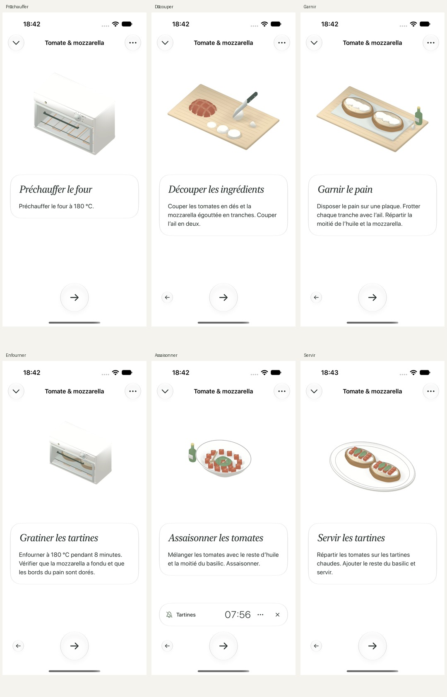

# Tartines — captures natives du 1 octobre 2026

Captures du parcours UI `testToastDisclosuresNavigationAndCompletion`, après les corrections de logique et de contact des six scènes Blender. App compilée et testée sur Petit Chef Croquis, iPhone 18 Pro / iOS 27.

- `home.png`, `recipe.png`, `sections.png` : accueil, fiche et sections.
- `preheat.png` : four vide et fermé, instruction limitée au préchauffage.
- `cutting.png` : découpe en cours ; six tranches de mozzarella à la fin du film.
- `building.png` : pain sur la plaque, ail, huile et trois tranches de mozzarella par tartine.
- `baking.png` : plaque enfournée, porte fermée, thermostat déjà réglé.
- `seasoning.png` : tomates assaisonnées et minuteur indépendant du film.
- `plating.png` : tomates et basilic sur les tartines déjà gratinées.
- `completion.png` : fin de recette.

Compilation, 24 tests unitaires et quatre parcours UI réussis. Le test paramétré des médias exécute six variantes : le rapport compte 28 cas et 33 exécutions, sans échec. Les sources et la reproduction des rendus sont décrites dans [le dossier des animations](../../design/animation-pilot/README.md).
